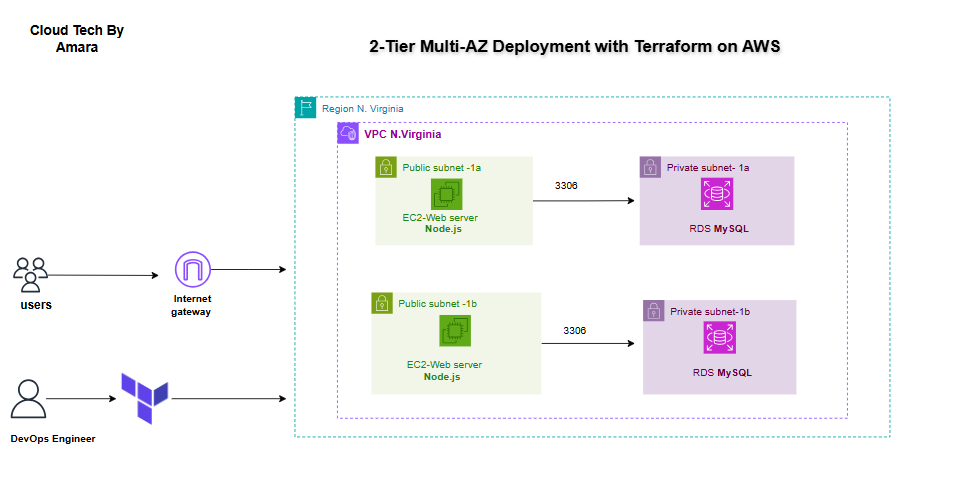

#  Epic Books — Two-Tier AWS Infrastructure with Terraform

A production-grade, modular Terraform project that provisions a complete two-tier AWS infrastructure for the Epic Books web application. The architecture consists of a public-facing EC2 frontend and a privately secured MySQL RDS database, built following AWS and DevOps best practices.

---

##  Architecture Overview



---

##  Features

- **Modular Terraform structure** — clean separation of concerns across four independent modules
- **Two-tier architecture** — public EC2 frontend and private RDS MySQL database
- **Least privilege security** — RDS only accepts traffic from the frontend security group, not the open internet
- **Defence in depth** — RDS is configured with publicly_accessible = false AND protected by a strict security group
- **No hardcoded values** — all configuration driven through variables and terraform.tfvars
- **Sensitive variable protection** — database credentials marked sensitive = true to prevent terminal exposure
- **Dynamic AMI fetching** — always pulls the latest Ubuntu 22.04 LTS AMI automatically
- **Multi-AZ subnet design** — subnets spread across us-east-1a and us-east-1b for RDS availability zone compliance

---

##  Project Structure

```
terraform-aws-epic-books/
│
├── main.tf                        # Root orchestrator — wires all modules together
├── variables.tf                   # Root variable declarations
├── outputs.tf                     # Root outputs (EC2 IP, RDS endpoint)
├── providers.tf                   # AWS provider and Terraform configuration
├── terraform.tfvars               # Variable values (git-ignored)
│
└── modules/
    ├── networking/
    │   ├── main.tf                # VPC, subnets, internet gateway, route table
    │   ├── variables.tf
    │   └── outputs.tf
    │
    ├── security_groups/
    │   ├── main.tf                # Frontend SG and RDS SG
    │   ├── variables.tf
    │   └── outputs.tf
    │
    ├── rds/
    │   ├── main.tf                # DB subnet group and RDS instance
    │   ├── variables.tf
    │   └── outputs.tf
    │
    └── frontend/
        ├── main.tf                # AMI data source and EC2 instance
        ├── variables.tf
        └── outputs.tf
```

---

##  Infrastructure Resources

| Resource | Details |
|---|---|
| VPC | 10.0.0.0/16 |
| Public Subnet 1 | 10.0.1.0/24 — us-east-1a |
| Public Subnet 2 | 10.0.2.0/24 — us-east-1b |
| Private Subnet 1 | 10.0.3.0/24 — us-east-1a |
| Private Subnet 2 | 10.0.4.0/24 — us-east-1b |
| Internet Gateway | Attached to VPC |
| Route Table | Public subnets only |
| Frontend Security Group | Inbound: 80, 22 — Outbound: All |
| RDS Security Group | Inbound: 3306 from frontend SG only |
| EC2 Instance | t2.micro — Ubuntu 22.04 LTS |
| RDS Instance | db.t3.micro — MySQL 8.0 — 20GB |

---

##  Security Design

**Frontend Security Group**
- Port 80 (HTTP) — open to 0.0.0.0/0
- Port 22 (SSH) — restricted to operator IP only
- Outbound — all traffic allowed

**RDS Security Group**
- Port 3306 (MySQL) — only accepts connections from the frontend security group ID, not a CIDR range
- This means no machine outside the frontend EC2 can reach the database, even if it knows the endpoint


---

##  Usage

**1. Clone the repository**
```bash
git clone https://github.com/Amarachi-Ezeonyekwere/terraform-aws-epic-books.git
cd terraform-aws-epic-books
```

**2. Create your terraform.tfvars file**
```hcl
project_name          = "epic-books"
vpc_cidr              = "10.0.0.0/16"
public_subnet_cidr_1  = "10.0.1.0/24"
public_subnet_cidr_2  = "10.0.2.0/24"
private_subnet_cidr_1 = "10.0.3.0/24"
private_subnet_cidr_2 = "10.0.4.0/24"
db_name               = "epicbooks"
db_username           = "your-db-username"
db_password           = "your-strong-password"
db_instance_class     = "db.t3.micro"
key_name              = "your-key-pair-name"
instance_type         = "t2.micro"
```

**3. Initialise Terraform**
```bash
terraform init
```

**4. Preview the infrastructure plan**
```bash
terraform plan
```

**5. Deploy the infrastructure**
```bash
terraform apply
```

**6. Access your outputs**

After a successful apply, Terraform will print:
```
Outputs:

frontend_public_ip  = "xx.xx.xx.xx"
frontend_public_dns = "ec2-xx-xx-xx-xx.us-east-1.compute.amazonaws.com"
rds_endpoint        = "epic-books-db.xxxxxxxxxx.us-east-1.rds.amazonaws.com:3306"
rds_db_name         = "epicbooks"
```

**7. SSH into your frontend**
```bash
ssh -i ~/your-key.pem ubuntu@<frontend_public_ip>
```

---

##  Destroy Infrastructure

To tear down all resources and avoid ongoing AWS charges:
```bash
terraform destroy
```

---

##  Important Notes

- **Never commit terraform.tfvars** — it contains sensitive credentials. It is listed in .gitignore
- **skip_final_snapshot = true** is set on the RDS instance for this project. In a production environment this should always be false
- The RDS instance is deployed in private subnets with no public endpoint — it is only reachable from within the VPC via the frontend EC2

---

##  .gitignore

```
terraform.tfvars
*.tfvars
.terraform/
.terraform.lock.hcl
terraform.tfstate
terraform.tfstate.backup
```

---

##  Tech Stack


---

##  Author

**Amarachi Ezeonyekwere**
- GitHub: [@Amarachi-Ezeonyekwere](https://github.com/Amarachi-Ezeonyekwere)
- LinkedIn: [Amarachi-Ezeonyekwere](https://linkedin.com/in/Amarachi-Ezeonyekwere)